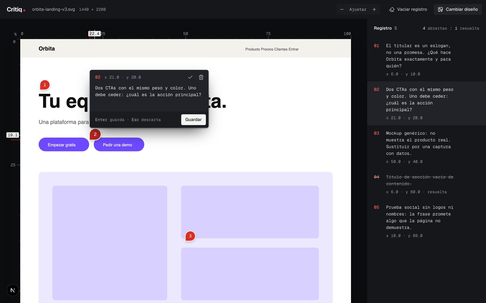
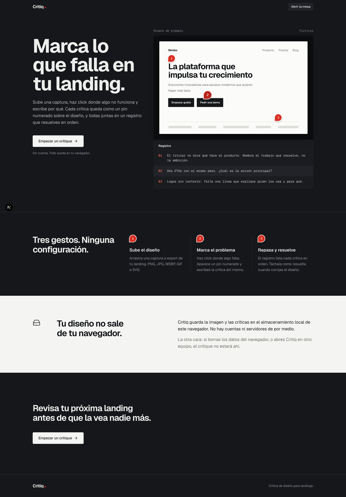

# Critiq

**Crítica de diseño para landings.** Sube una captura, haz click donde algo no funciona y escribe por qué. Cada crítica queda como un pin numerado sobre el diseño, y todas juntas en un registro que resuelves en orden.

<p align="center">
  
</p>

<details>
<summary><strong>Ver la landing completa</strong></summary>
<br>
<p align="center">
  
</p>
</details>

---

## Qué es

Critiq es una herramienta minimalista de *design critique* pensada para diseñadores que revisan su propia landing antes de entregarla o publicarla. Convierte una revisión dispersa (notas sueltas, capturas con flechas) en una lista ordenada de críticas ancladas a coordenadas exactas del diseño.

Feedback tipo Figma, sin Figma: basta una imagen. **Sin cuentas, sin equipo, sin backend**: todo vive en el navegador.

La app tiene dos pantallas:

- **`/`** — Landing que explica el producto con una demo de ejemplo.
- **`/critique`** — La mesa de trabajo donde se hace la crítica.

## Herramientas de la mesa de crítica

| Herramienta | Qué hace |
| --- | --- |
| **Subida de diseño** | Input o arrastrar y soltar. Admite PNG, JPG, WEBP, GIF y SVG. |
| **Pins numerados** | Click sobre el diseño para crear una crítica. El pin se ancla por la punta a la coordenada exacta (en %) y mantiene su tamaño a cualquier zoom. |
| **Composer** | Popover para escribir la crítica junto al pin. `Enter` guarda · `Esc` descarta. |
| **Registro** | Panel lateral con todas las críticas, sincronizado con el lienzo. Muestra abiertas / resueltas. |
| **Resolver, editar y eliminar** | Cada crítica se puede marcar como resuelta (se tacha), reabrir, editar o borrar. |
| **Reglas en %** | Reglas superior e izquierda con lectura del cursor y de la coordenada del pin activo. |
| **Zoom** | "Ajustar" al ancho o pasos de 25 % a 200 %. |
| **Vaciar registro / Cambiar diseño** | Reinicia las críticas o sustituye la imagen (con confirmación). |
| **Persistencia local** | Imagen y críticas se guardan en `localStorage`, tras un store aislado para poder migrar a una API más adelante. |

## Stack

- [Next.js 16](https://nextjs.org) (App Router) + React 19
- TypeScript
- [Tailwind CSS v4](https://tailwindcss.com) con tokens propios (la paleta por defecto está desactivada)
- [Radix UI](https://www.radix-ui.com) (Popover, Alert Dialog)
- [Lucide](https://lucide.dev) para iconos
- Tipografías Geist Sans y Geist Mono vía `next/font`

## Base de diseño: "La mesa de luz"

El sistema visual trata cada diseño como una hoja sobre la mesa de luz de un editor fotográfico:

- **Escritorio grafito oscuro** para la interfaz, que se retira a la sombra.
- **Un único escenario claro**: solo el diseño en revisión está "iluminado".
- **Una sola tinta roja de lápiz graso**, reservada exclusivamente a las críticas (pins y números). Los errores usan ámbar.
- **Dos voces tipográficas**: Geist Sans para la interfaz, Geist Mono para todo lo que es anotación (números, coordenadas, texto de crítica).
- **Zonas separadas por tono, no por bordes**; sombras solo para objetos físicos (la hoja, el pin, los popovers).

Documentación del sistema:

- [`tokens.md`](tokens.md) — fuente de verdad de los valores (color, tipo, radios, sombras, movimiento).
- [`DESIGN.md`](DESIGN.md) — cómo y dónde se aplican los tokens, reglas y componentes.
- [`PRODUCT.md`](PRODUCT.md) — usuarios, propósito y principios del producto.

## Empezar

```bash
npm install
npm run dev
```

Abre [http://localhost:3000](http://localhost:3000).

| Script | Descripción |
| --- | --- |
| `npm run dev` | Servidor de desarrollo |
| `npm run build` | Build de producción |
| `npm run lint` | ESLint |
| `npm run tokens:check` | Verifica que `app/globals.css` coincide con `tokens.md` |

## Estructura

```
app/                 Rutas: landing (/) y mesa de crítica (/critique)
components/landing   Secciones de la landing
components/critique  Lienzo, pins, composer, registro y barra de herramientas
components/ui        Botón y diálogo de confirmación
lib/critique         Tipos, reducer, store y persistencia local
```
